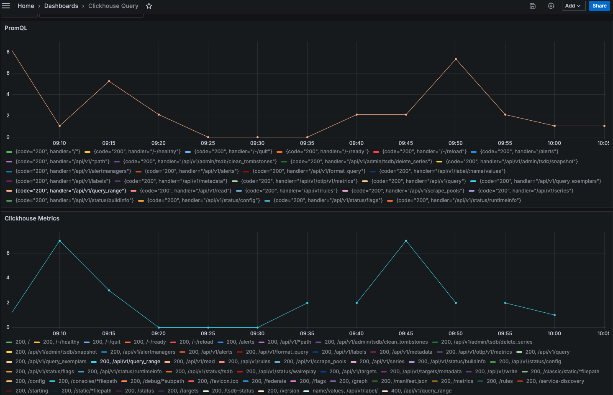

# Go Client supporting Exporter schemas provided by OpenTelemetry

This project is a Work in progress and only Supports ClickHouse at this time.
The Sum and Gauge Metrics queries are accurate and have been validated against
PromQL.

## ClickHouse Exporter

This project provides a Query Builder for Sum and Gauge Metrics that are compatible with the ClickHouse schema produced by [Clickhouse Exporter](https://github.com/open-telemetry/opentelemetry-collector-contrib/tree/main/exporter/clickhouseexporter). It calculates the Increase for Sum Metrics following the patterns established in the [Altinity Grafana DataSource](https://grafana.com/grafana/plugins/vertamedia-clickhouse-datasource/) but is more optimized using Windowing.

## SQL Query Builder Sum

This example expects the `Attributes` from each Metric to contain
a `handler` and `code` key.
 The SQL Query Builder will generate the following query
using the base parameters.

```go
var start, _ = time.Parse(time.RFC3339, "2024-05-01T00:00:00Z")
var end, _ = time.Parse(time.RFC3339, "2024-05-02T00:00:00Z")

builder := NewSumMetricSQLBuilder()
assert.NotNil(t, builder, "Expected non-nil builder instance")
builder.Select("handler", "code")
builder.From("otel_metrics_sum")
builder.MetricName("prometheus_http_requests_total")
builder.Range(start, end)
builder.Interval(300)

sql, err := builder.Build()
assert.Nil(t, err, "Expected error to be nil")
fmt.Print(sql)
```

```sql
SELECT  arrayElement(splitByString(':', increaseKey), 1) AS handler, arrayElement(splitByString(':', increaseKey), 2) AS code,
  toDateTime(intDiv(toUInt32(TimeUnix), 300) * 300) AS UsageTime,
  sum(IncreaseValue) as Usage
FROM (
    SELECT concat(Attributes['handler'] ,':',  Attributes['code']  ) as increaseKey,
    TimeUnix,
	MetricName,
    lagInFrame(Value) OVER (PARTITION BY increaseKey ORDER BY TimeUnix ASC ROWS BETWEEN 1 PRECEDING AND UNBOUNDED FOLLOWING) AS prevValue,
	0 Mark,
	COUNT(Mark) OVER (PARTITION BY increaseKey ORDER BY	TimeUnix ROWS 1 PRECEDING)-1 = 1 PrevExists,
	if(PrevExists,
	    if( prevValue > Value,
			if(prevValue = 0,
			    0,
			    Value),
		Value - prevValue),
	0) as IncreaseValue
    FROM otel_metrics_sum
    WHERE MetricName = 'prometheus_http_requests_total'
	    AND NOT isNaN(Value)
        
        AND TimeUnix BETWEEN (toDateTime('2024-05-01 00:00:00') - INTERVAL 300 SECOND) AND toDateTime('2024-05-02 00:00:00') ) AS data
GROUP BY
	increaseKey,
	UsageTime
ORDER BY
	increaseKey,
	UsageTime
```

## Using Query in Grafana

You can wrap the base query using a sub-query to allow the use of
`Time series` charts.

This example shows the side by side comparison with PromQL.

```sql
sum(increase({__name__="prometheus_http_requests_total"}[5m])) by (handler, code)
```

```sql
SELECT UsageTime AS t, code, handler, sum(Usage) as Usage 
FROM (
SELECT  arrayElement(splitByString(':', increaseKey), 1) AS handler, arrayElement(splitByString(':', increaseKey), 2) AS code,
  toDateTime(intDiv(toUInt32(TimeUnix), 300) * 300) AS UsageTime,
  sum(IncreaseValue) as Usage
FROM (
    SELECT concat(Attributes['handler'] ,':',  Attributes['code']  ) as increaseKey,
    TimeUnix,
	MetricName,
    lagInFrame(Value) OVER (PARTITION BY increaseKey ORDER BY TimeUnix ASC ROWS BETWEEN 1 PRECEDING AND UNBOUNDED FOLLOWING) AS prevValue,
	0 Mark,
	COUNT(Mark) OVER (PARTITION BY increaseKey ORDER BY	TimeUnix ROWS 1 PRECEDING)-1 = 1 PrevExists,
	if(PrevExists,
	    if( prevValue > Value,
			if(prevValue = 0,
			    0,
			    Value),
		Value - prevValue),
	0) as IncreaseValue
    FROM default.otel_metrics_sum
    WHERE MetricName = 'prometheus_http_requests_total'
    AND TimeUnix >= toDateTime64(1725636368, 3) AND TimeUnix <= toDateTime64(1725639968, 3)
	    AND NOT isNaN(Value)
                
                ) AS data
GROUP BY
	increaseKey,
	UsageTime
ORDER BY
	increaseKey,
	UsageTime

) GROUP BY t, code, handler
ORDER BY t, code, handler
```



### Clickhouse Compression

Storing metrics in Clickhouse compresses the data considerably.
Large data sets can compress over 350% and still provide sub second
response time.

See [Clickhouse docs](https://clickhouse.com/docs/en/data-compression/compression-in-clickhouse)
for examples of common Clickhouse queries.

The following query will show the compression rates.  These results were for a
small subset of data.  The larger the data size the better compression ratio you may see.

```sql
SELECT
    `table`,
    formatReadableSize(sum(data_compressed_bytes)) AS compressed_size,
    formatReadableSize(sum(data_uncompressed_bytes)) AS uncompressed_size,
    round(sum(data_uncompressed_bytes) / sum(data_compressed_bytes), 2) AS ratio
FROM system.columns
WHERE data_uncompressed_bytes > 0
GROUP BY
    `table`
ORDER BY
    `table` ASC
```

|table|compressed_size|uncompressed_size|ratio|
|-----|---------------|-----------------|-----|
|otel_metrics_sum|638.82 KiB|99.27 MiB|159.13|

## Additional Documentation

See [docs](./docs/index.md)
